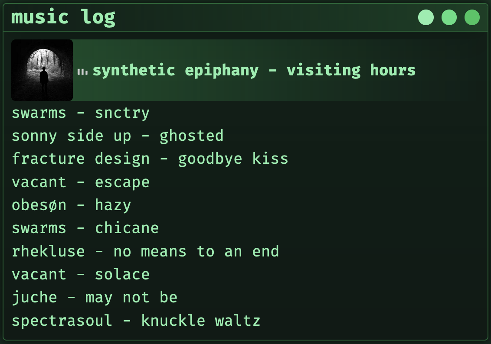
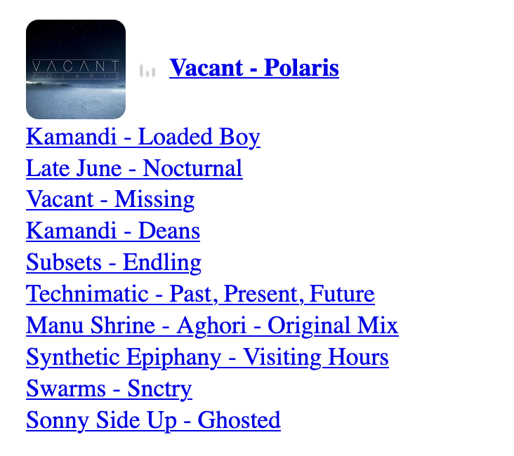

# lastfm_playlist

## Install

```
npm i lastfm_playlist
```

## About

Lastfm_playlist is designed to work with Vite/React combo. It allows you to display the current song playing with album art and a list of songs previously played. If there's no song playing, it will display "No music playing" at the top of the list. I have replaced the placeholder art with `artist - song` instead since it's pretty ugly.

## Example

You can see it in action on my [webpage](https://vagabond.sh) or see the example below.

## Screenshot

This example is using custom styling which is not included.



## API Key

You will need an last.fm API key for this to work. You can get one from [here](https://www.last.fm/api/account/create).
You will then want to add the key to your .env file. If you don't have one, create one in your root directory and then add the following.

```
VITE_LASTFM = "API_KEY_HERE"
```

## Import Component

Put the following at the top of your component where you want to show your music.

```tsx
import LastFMPlaylist from "lastfm_playlist";
```

## Component with props

Finally, put the component in your code as desired.

```tsx
<LastFMPlaylist user={"username"} refresh={30} limit={10} />
```

- **user**: _string_ - Put your username here. Default value is my username.
- **refresh**: _number_ - Put the number of seconds you want the component to refresh to keep the list updated. Default value is 30.
- **limit**: _number_ - Shows how many songs in your list. I believe this caps out at 200. Default value is 10.

## Styling

I have only provided the minimal amount of styling to keep it open for personal styling preference. When imported in a project with no CSS, it'll look as such:


